# SecureTransact API - Architecture Diagrams

Visual documentation for the SecureTransact API architecture using Mermaid diagrams. This document covers the system's Clean Architecture layers, CQRS pipelines, Event Sourcing mechanics, cryptographic integrity, deployment topology, and more.

> **Note:** All diagrams use [Mermaid](https://mermaid.js.org/) syntax and render natively on GitHub.

---

## Table of Contents

1. [Clean Architecture Layers](#1-clean-architecture-layers)
2. [CQRS Command Pipeline](#2-cqrs-command-pipeline)
3. [CQRS Query Pipeline](#3-cqrs-query-pipeline)
4. [Event Sourcing Write Path](#4-event-sourcing-write-path)
5. [Event Sourcing Read Path](#5-event-sourcing-read-path)
6. [Hash Chain Cryptography](#6-hash-chain-cryptography)
7. [Transaction State Machine](#7-transaction-state-machine)
8. [HTTP Request Pipeline](#8-http-request-pipeline)
9. [Deployment Architecture](#9-deployment-architecture)
10. [Database Schema](#10-database-schema)
11. [Domain Model Class Diagram](#11-domain-model-class-diagram)
12. [Dependency Injection Graph](#12-dependency-injection-graph)

---

## 1. Clean Architecture Layers

The solution follows Clean Architecture with strict inward-pointing dependencies. The Domain layer sits at the core with zero external dependencies, the Application layer references only the Domain, and the outer layers (Infrastructure and API) depend on the inner layers but never the reverse.

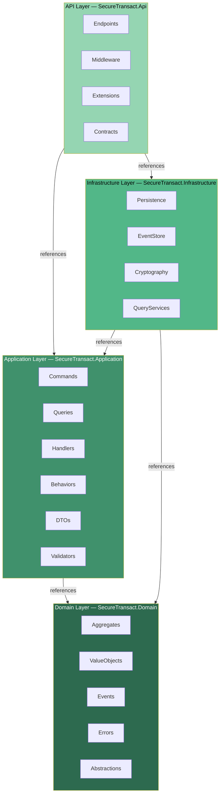

---

## 2. CQRS Command Pipeline

Commands (write operations) flow through the MediatR pipeline. Each command passes through validation and logging behaviors before reaching the handler, which interacts with the domain aggregates and persists changes through the repository and unit of work.

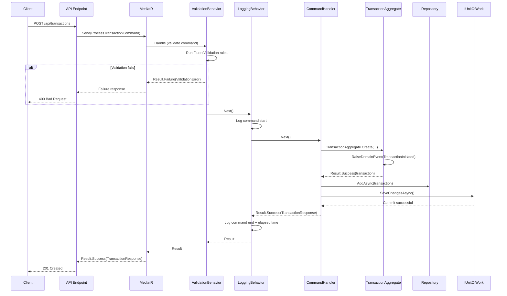

---

## 3. CQRS Query Pipeline

Queries (read operations) follow a separate path that bypasses the domain aggregates entirely. They read directly from the read model database through dedicated query services, ensuring read and write concerns are fully separated.

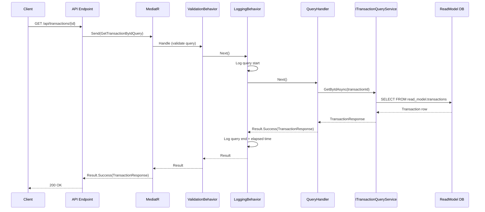

---

## 4. Event Sourcing Write Path

When a command mutates an aggregate, the resulting domain events are persisted to the event store. Each event is encrypted with AES-256-GCM, hash-chained with HMAC-SHA512 for tamper detection, and assigned a monotonically increasing version number for optimistic concurrency control.

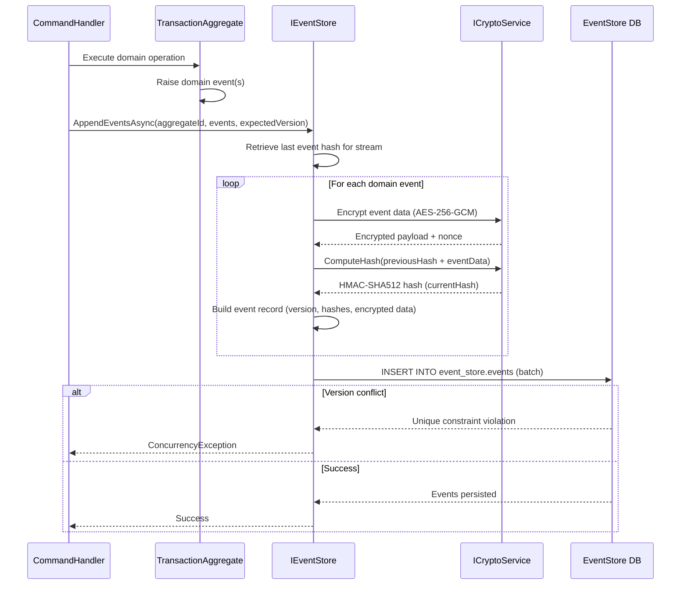

---

## 5. Event Sourcing Read Path

Rehydrating an aggregate from the event store involves reading its full event stream, decrypting each event, and validating the hash chain to detect any tampering. The events are then replayed in order to reconstruct the aggregate's current state.

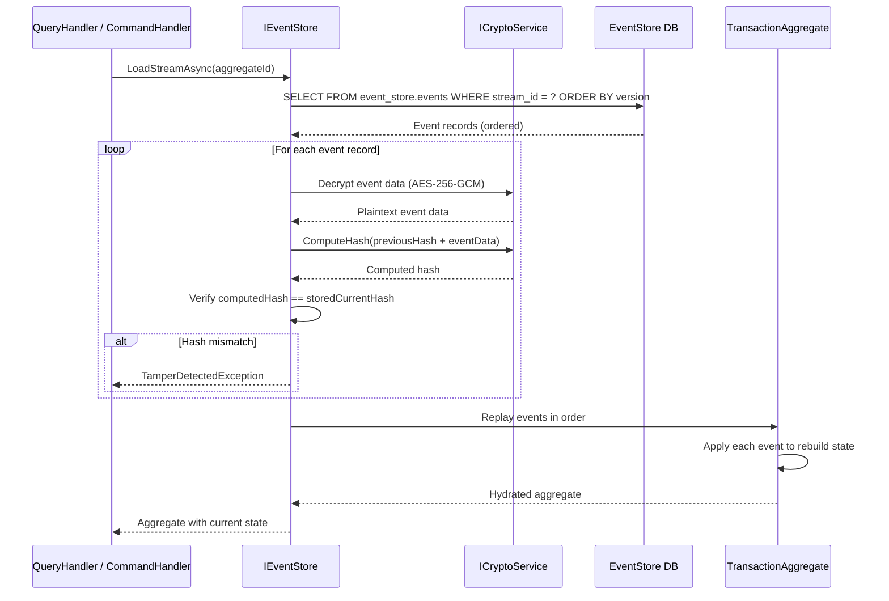

---

## 6. Hash Chain Cryptography

Each event in the store is linked to its predecessor through a cryptographic hash chain. The current event's hash is computed over the previous event's hash concatenated with the current event's data, forming an immutable, tamper-evident sequence. AES-256-GCM provides authenticated encryption of event payloads, while HMAC-SHA512 produces the chain hashes.

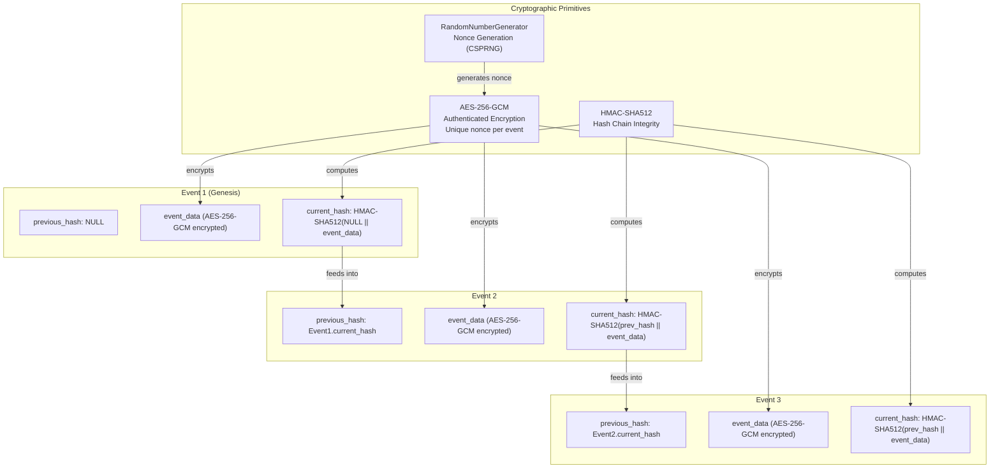

---

## 7. Transaction State Machine

The transaction lifecycle is modeled as a finite state machine. Each transition corresponds to a domain event and enforces strict business rules about which state changes are permitted. Failed and Reversed are terminal states with no outbound transitions.

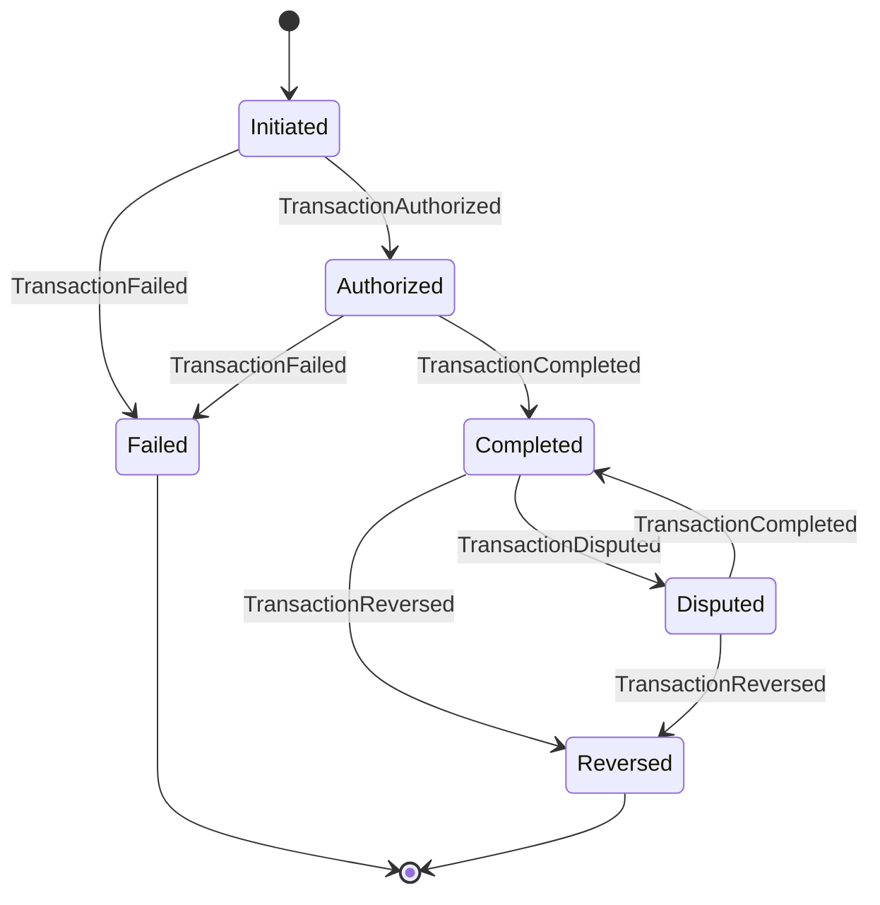

---

## 8. HTTP Request Pipeline

Incoming HTTP requests traverse a layered middleware pipeline before reaching the endpoint handler. Each middleware component handles a specific cross-cutting concern such as security headers, exception handling, structured logging, authentication, and authorization.

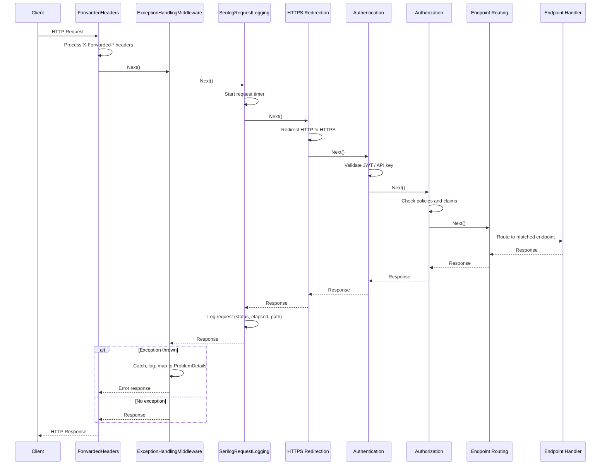

---

## 9. Deployment Architecture

The production deployment runs on Azure Container Apps with a managed PostgreSQL database hosted on Neon.tech. Container images are built and pushed to Azure Container Registry via GitHub Actions, and secrets are managed through Azure Key Vault.

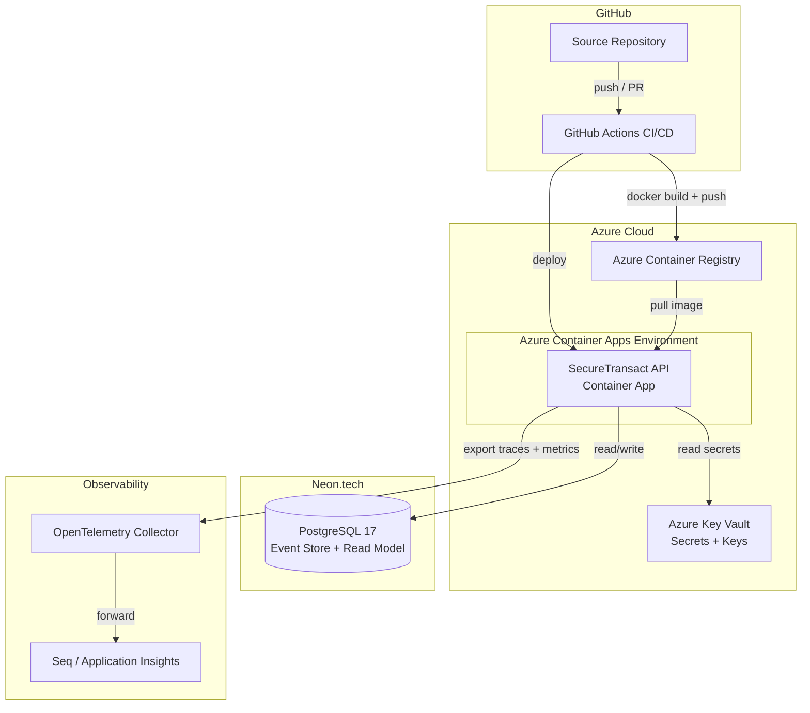

---

## 10. Database Schema

The system uses two separate schemas within PostgreSQL. The `event_store` schema holds the append-only event log with hash-chained integrity. The `read_model` schema holds the denormalized projection optimized for queries.

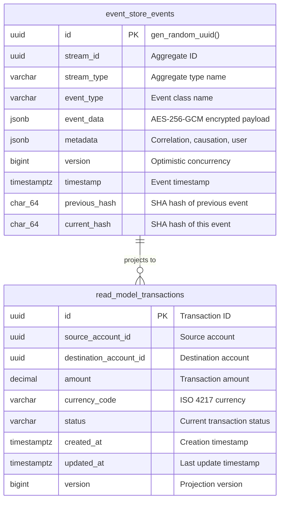

---

## 11. Domain Model Class Diagram

The domain model centers on the TransactionAggregate, which extends AggregateRoot and encapsulates all transaction lifecycle logic. Value objects enforce invariants at creation, and domain events capture every state change for the event store.

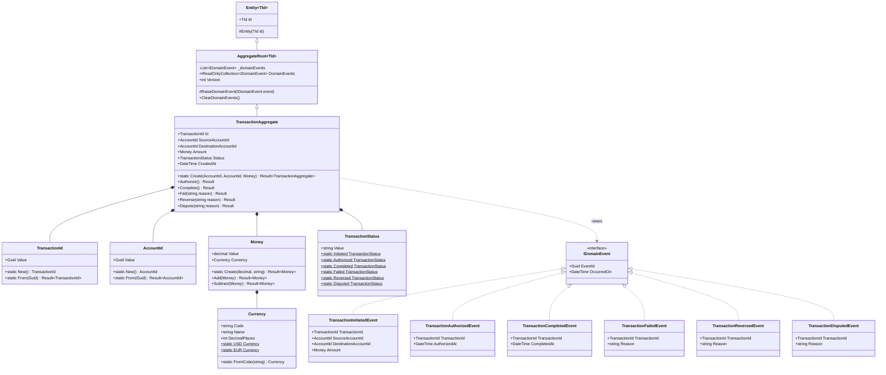

---

## 12. Dependency Injection Graph

Services are registered with appropriate lifetimes to balance performance and correctness. The CryptoService is a singleton since it is stateless and thread-safe. Repositories, the Unit of Work, EventStore, and QueryService are scoped to the HTTP request to ensure proper DbContext lifetime management. MediatR handlers and validators are registered as transient.

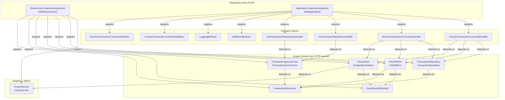

---

*Generated for the SecureTransact API project by MancoMen Software Studio.*
